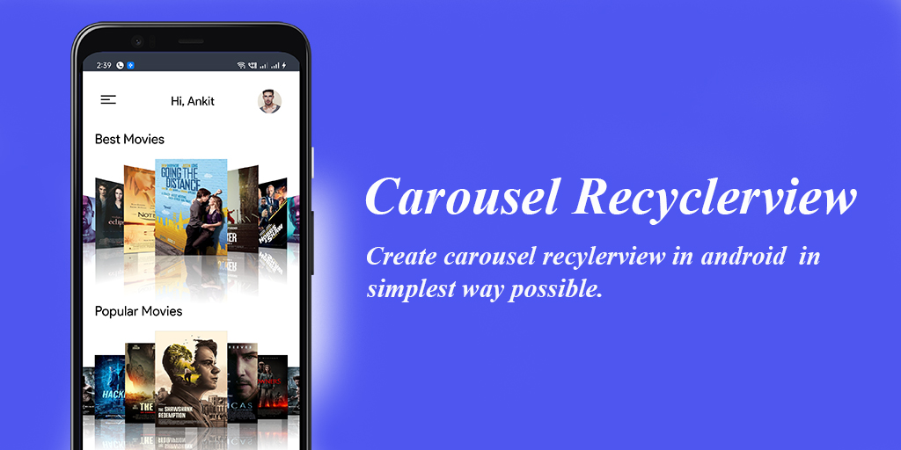

<h1 align="center">  Carousel Recyclerview </h1>

<p align="center">
Create carousel effect in recyclerview with the CarouselRecyclerview in a simple way.
</p>
</br>
<p align="center">
  <a href="https://opensource.org/licenses/Apache-2.0"></a>
  <a href="http://developer.android.com/index.html"></a>
    <a href="https://android-arsenal.com/api?level=16"></a>
</p>
</br>




## Including in your project


[](https://jitpack.io/#sparrow07/CarouselRecyclerview)

### Gradle 
Add below codes to your **root** `build.gradle` file (not your module build.gradle file).
```Gradle
allprojects {
    repositories {
            mavenCentral()
    }
}
```
And add a dependency code to your **module**'s `build.gradle` file.
```gradle
dependencies {
   implementation 'com.github.sparrow007:carouselrecyclerview:1.0.0'
}
```

## Usage

### Basic Example for Kotlin
Here is a basic example of implementing carousel recyclerview in koltin files (activity or fragment) with attribute.

```kotlin
  val carouselRecyclerview = findViewById<CarouselRecyclerview>(R.id.recycler)
  carouselRecyclerview.adapter = adapter
```
### Basic Example for XML
Here is a basic example of implementing carousel recyclerview in layout xml.

```xml
<com.jackandphantom.carouselrecyclerview.CarouselRecyclerview
     android:layout_width="match_parent"
     android:layout_height="wrap_content"
     android:id="@+id/recycler"/>
```

Property infinite and 3D on Item enabled |Property infinite and alpha on Item enabled |
| :---------------: | :---------------: | 
|  |  |

## API Methods

Method | Description | Default
---|--- |---
  fun set3DItem(is3DItem: Boolean) | Make the view tilt according to their position, middle position does not tilt. | false
  fun setInfinite(isInfinite: Boolean) | Create the loop of the given view means there is no start or end, but provided position in the interface will be correct. | false
  fun setFlat(isFlat: Boolean) | Make the flat layout in the layout manager of the reyclerview | false
  fun setAlpha(isAlpha: Boolean) | Set the alpha for each item depends on the position in the layout manager | false
  fun setIntervalRatio(ratio: Float) | Set the interval ratio which is gap between items (views) in layout manager | 0.5f (value of gap, it should in range (0.4f - 1f))
  fun getCarouselLayoutManager(): CarouselLayoutManager | Get the carousel layout manager instance | 
  fun getSelectedPosition(): Int | Get selected position from the layout manager | center view Positoin

  ## API Methods Usage
  ```Kotlin
  val carouselRecyclerview = findViewById<CarouselRecyclerview>(R.id.recycler)
        carouselRecyclerview.adapter = adapter
        carouselRecyclerview.set3DItem(true)
        carouselRecyclerview.setInfinite(true)
        carouselRecyclerview.setAlpha(true)
        carouselRecyclerview.setFlat(true)
        val carouselLayoutManager = carouselRecyclerview.getCarouselLayoutManager()
        val currentlyCenterPosition = carouselRecyclerview.getSelectedPosition()
  
  ```
  ## Item Position Listener
  You can listen to the position whenever the scroll happens you will get notified about the position, following are codes for listener

  ```Kotlin
   carouselRecyclerview.setItemSelectListener(object : OnSelected {
            override fun onItemSelected(position: Int) {
                //Cente item
            }
        })
  
  ```

## Reflection ImageView

You see in the demo that there is a mirror image (reflection imageview), for this i already created custom imageview for this.


Use ReflectionImageView in xml layout and provide src

```xml
 <com.jackandphantom.carouselrecyclerview.view.ReflectionImageView
     android:layout_width="120dp"
     android:layout_height="120dp"
     android:scaleType="fitXY"
     android:src="@drawable/hacker"
    />
```

### Notes about Reflection imageview
I would recommend you to use image loading library like Glide for loading image in reflection image for better performance


## Contribute 🤝
If you like the project and somehow wants to contribute, you are welcome to contribute by either submitting issues, refactor, pull request Thankyou.

## Find this repository useful? ❤️
Support it by joining __[stargazers](https://github.com/sparrow007/CarouselRecyclerview/stargazers)__ for this repository. :star: <br>
 And __[follow](https://github.com/sparrow007)__  me for next creation 🤩


## License
```xml
Copyright 2021 Sparrow007 (Ankit kumar)

Licensed under the Apache License, Version 2.0 (the "License");
you may not use this file except in compliance with the License.
You may obtain a copy of the License at

   http://www.apache.org/licenses/LICENSE-2.0

Unless required by applicable law or agreed to in writing, software
distributed under the License is distributed on an "AS IS" BASIS,
WITHOUT WARRANTIES OR CONDITIONS OF ANY KIND, either express or implied.
See the License for the specific language governing permissions and
limitations under the License.
```
